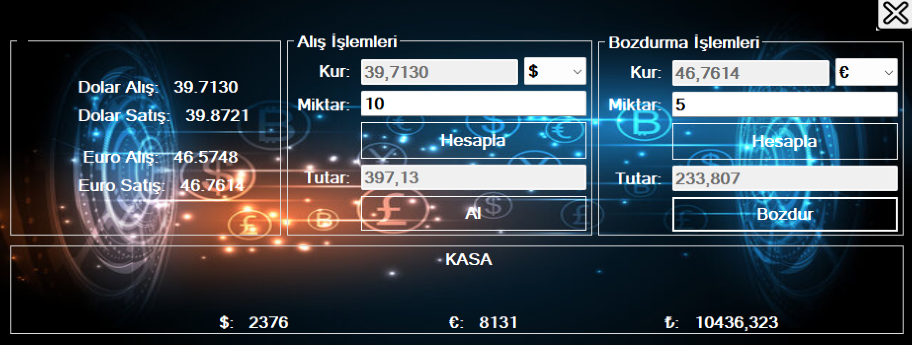

# 💱 Currency Exchange - C# Windows Forms App

A desktop application simulating a basic **Currency Exchange Office** built with **C# Windows Forms** and **SQL Server**. It allows users to **buy/sell USD and EUR**, fetches real-time exchange rates from the **Central Bank of Turkey (TCMB)**, and updates the local balance after each transaction.

## 📸 Images

## 🌟 Features

- 📈 Real-time exchange rate fetching from [TCMB XML API](https://www.tcmb.gov.tr/kurlar/today.xml)
- 💰 Buy and sell operations for USD and EUR
- 📊 Local cash register tracking: USD, EUR, and Turkish Lira balances
- 🧮 Auto-calculations for amount and total based on selected exchange rate
- 🗃️ SQL Server integration for transaction history and cash updates
- ✨ Simple and intuitive UI built with Windows Forms

## 🛠️ Technologies Used

- C# (.NET Framework)
- Windows Forms
- ADO.NET (for SQL Server access)
- XML Parsing
- SQL Server (LocalDB or full version)
